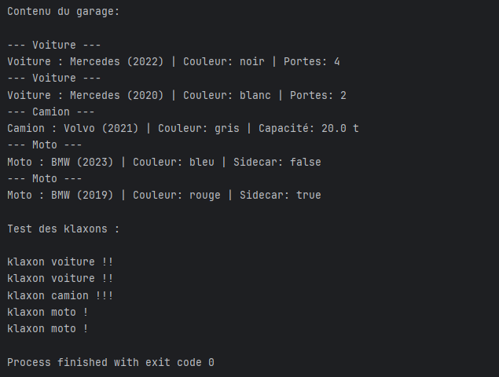
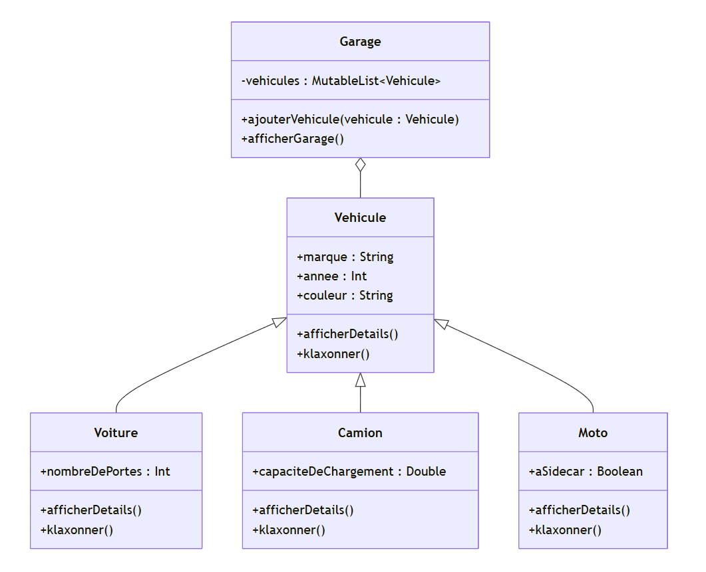

# TP-1 : Système de Gestion de Véhicules :

Projet Kotlin réalisé dans le cadre du cours de Jetpack Android Kotlin à l'ESGI.
Date 10/06/2026

## Objectif :

L'objectif de ce travail est de mettre en pratique l'implémentation de l'héritage et du polymorphisme
en Kotlin à travers le développement d'un système de gestion simple pour différents types de véhicules.
J'ai crée une hiérarchie de classes pour représenter différents types de véhicules
et utilisé le polymorphisme pour effectuer des opérations communes sur ces véhicules.

## Description :
Chaque véhicule peut être une voiture, un camion ou une moto.
Chaque type de véhicule a des caractéristiques spécifiques en plus des caractéristiques communes à tous les véhicules.

## Structure du projet :

```
GestionVehicules/
└── src/
    ├── modeles/
    │   ├── Vehicule.kt       # classe abstraite de base
    │   ├── Voiture.kt        # sous-classe avec nombre de portes
    │   ├── Camion.kt         # sous-classe avec capacité de chargement
    │   └── Moto.kt           # sous-classe avec présence de sidecar
    ├── Garage.kt             # gestion de la collection de véhicules
    └── Main.kt               # tests et point d'entrée
```

## Lancer le projet

1. Ouvrir le projet dans **IntelliJ IDEA**
2. Ouvrir `src/Main.kt`
3. Cliquer sur le bouton **Run** ou faire `Shift + F10`

## Execution :



## Ce qui a été implémenté :

- Classe abstraite `Vehicule` avec les attributs communs et les méthodes abstraites
- Sous-classes `Voiture`, `Camion` et `Moto` héritant de `Vehicule` avec leurs attributs spécifiques
- Classe `Garage` utilisant le polymorphisme et le mot-clé `is` pour gérer les véhicules
- Fonction `main` testant l'ajout de véhicules au garage et leurs klaxons

## Diagramme de classes :



### explication :
- `Vehicule` est la classe abstraite parente dont héritent toutes les autres
- `Voiture`, `Camion` et `Moto` héritent de `Vehicule` et ajoutent chacun un attribut spécifique
- `Garage` contient une liste de `Vehicule` et utilise le polymorphisme pour les manipuler
- La flèche `<--` représente l'héritage, `le losange` représente la composition

## Réponses aux questions du devoir :

### Approche de conception

- J'ai rendu la classe `Vehicule` abstraite car on ne crée jamais un véhicule générique
- Les méthodes `afficherDetails()` et `klaxonner()` sont abstraites pour forcer chaque sous-classe à les implémenter
- La classe `Garage` stocke une liste de type `Vehicule` pour manipuler tous les types de manière uniforme
- Le polymorphisme permet d'appeler les méthodes spécifiques à chaque type sans connaître le type exact

### Difficultés rencontrées

- Comprendre comment transmettre les paramètres du constructeur parent depuis les sous-classes
- Savoir comment utiliser le mot-clé `is` pour identifier le type concret d'un véhicule dans `afficherGarage()`

### Comment elles ont été résolues

- Pour l'héritage du constructeur : utilisation de la syntaxe `: Vehicule(marque, annee, couleur)` dans chaque sous-classe
- Pour l'identification du type : utilisation d'une expression `when` combinée avec `is` pour afficher le type avant les détails
